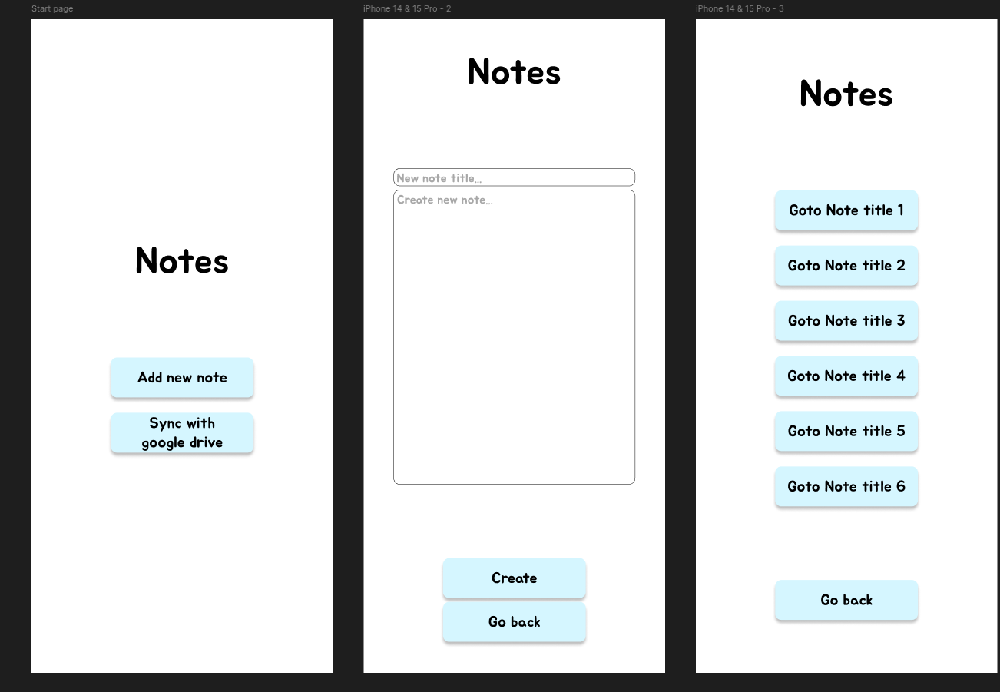
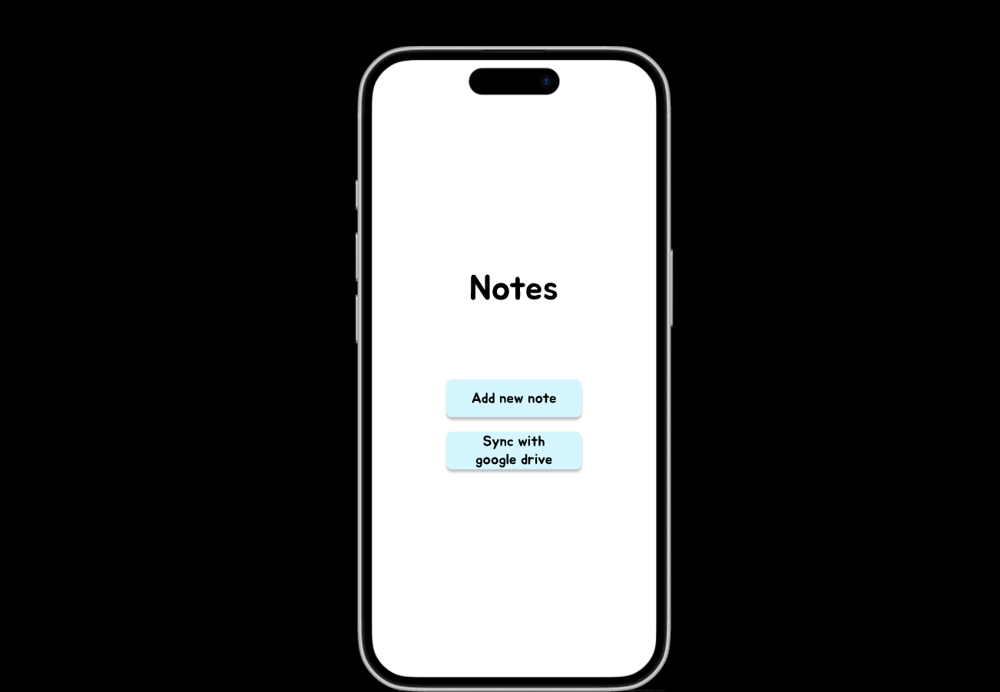
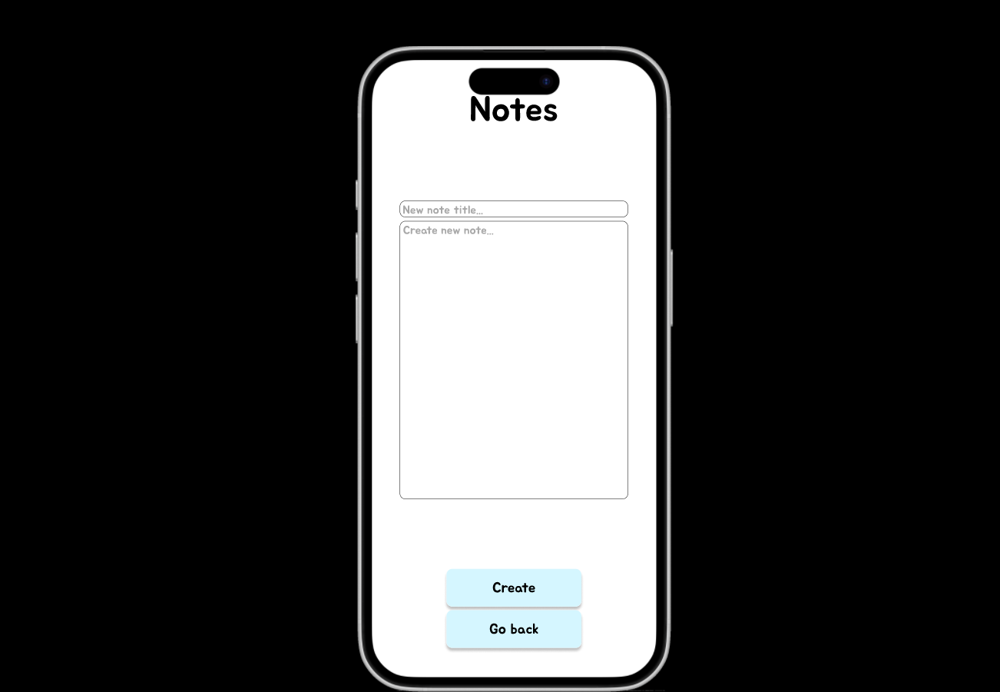
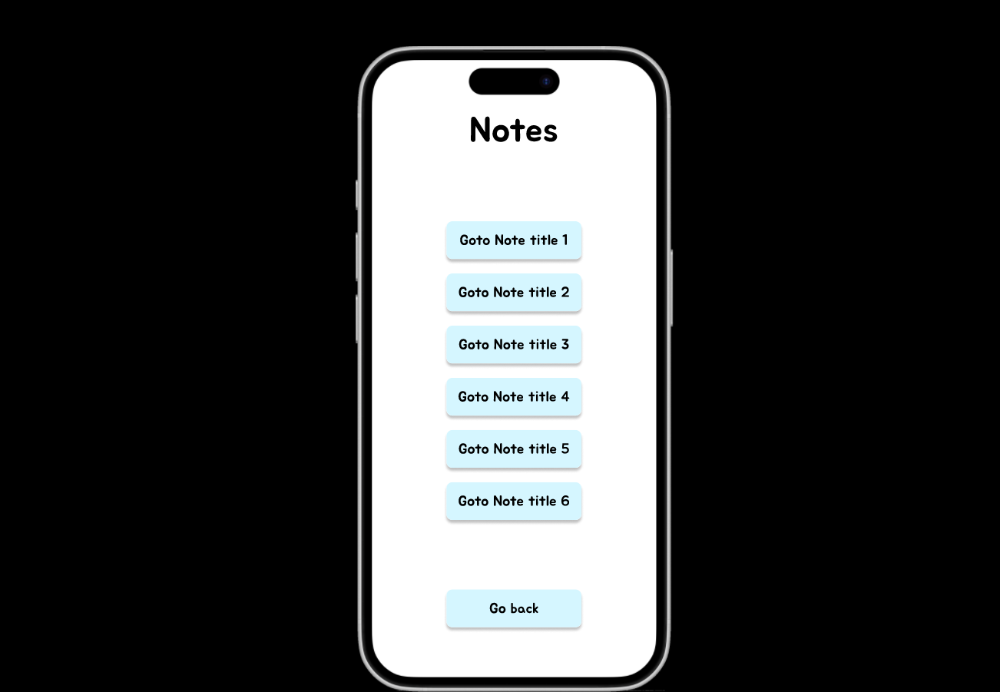

# Готовый прототип псевдо-приложения о заметках:
### [Clickable URL](https://www.figma.com/proto/vENjRLkqRjP1G1VHBs648N/Prototype_App_Nugumanov?node-id=2-6&t=6KDhdq8WO3aKSYzf-0&scaling=scale-down&content-scaling=fixed&page-id=0%3A1&starting-point-node-id=2%3A6)

# Design view

# Prototype view

# Present view

Создано 3 экрана, использованы базовые фигуры, навигация через interactions